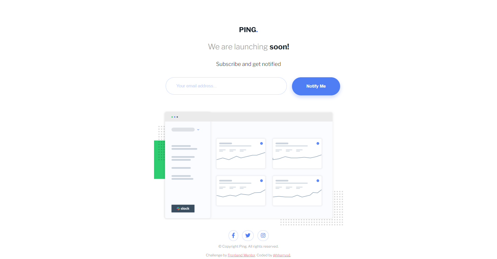
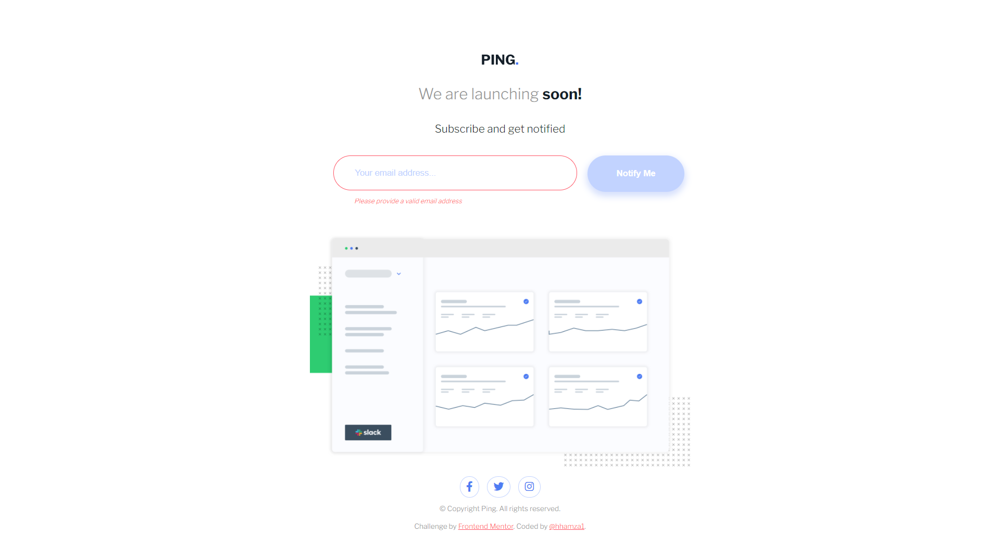

# Frontend Mentor - Ping Coming Soon Page

This is a solution to the [ping coming soon page component challenge on Frontend Mentor](https://www.frontendmentor.io/challenges/single-price-grid-component-5ce41129d0ff452fec5abbbc)

## Table of contents

- [Overview](#overview)
  - [The challenge](#the-challenge)
  - [Screenshot](#screenshot)
  - [Links](#links)
- [My process](#my-process)
  - [Built with](#built-with)
- [Author](#author)

## Overview

### The challenge

Users should be able to:

- View the optimal layout for the site depending on their device's screen size
- See hover states for all interactive elements on the page
- Submit their email address using an input field
- Receive an error message when the form is submitted if:
    - The input field is empty
    - The email address is not formatted correctly

### Screenshot

#### Mobile View

#### Mobile View - Active-state

#### Desktop View

#### Desktop View

### Links

- Solution URL: [Github Repo](https://github.com/hhamza1/fem-ping-coming-soon-page)
- Live Site URL: [Live Preview](https://hhamza1.github.io/fem-ping-coming-soon-page/)

## My process

### Built with

- HTML
- CSS
- Mobile-first workflow
- Flexbox

## Author

- Website - [Hamza H.](https://roverhollow-yetqlu-3881733548360.stormkit.dev/)
- Frontend Mentor - [@hhamza1](https://www.frontendmentor.io/profile/hhamza1)
- Twitter - [@Hamza80780203](https://twitter.com/Hamza80780203)